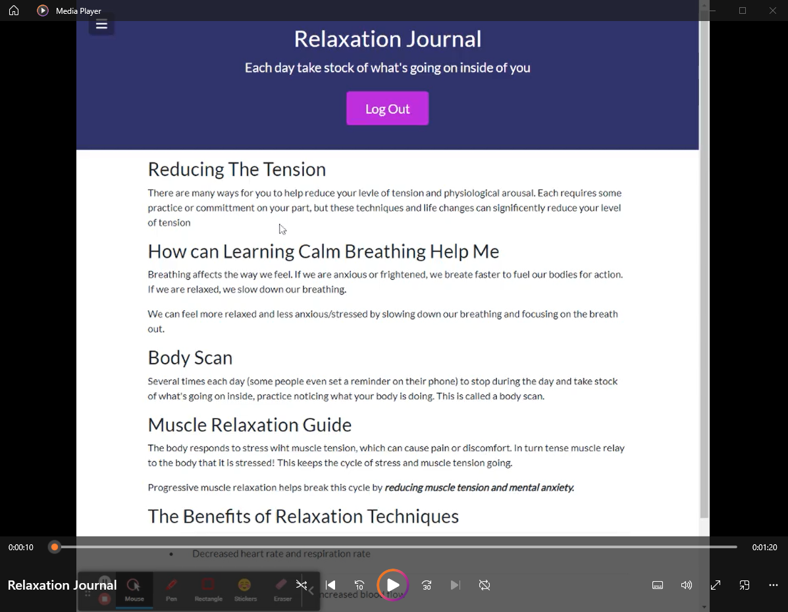

# My Relaxation Journal

[](https://opensource.org/licenses/MIT)
[](code_of_conduct.md)

## Description 
A full stack web application for relaxation.  This app contains clinical techniques and methodologies used to soothe anxiety, depression, stress, and irritation.  

A user can keep track of their stress and relaxation in their own individual log.  

### [Deployed Link](https://relaxationjournalclient.onrender.com/)
### [GitHub repository](https://github.com/espinbrandon49/Relaxation_Journal)

### Tools
* Client - React, react-bootstrap, JSX, React hooks, CSS, Axios
* Server - Node.js, Express, MongoDB, Mongoose, dotenv
 
## Table of Contents 
  * [Usage](#usage)
  * [Demo Video](#demo)
  * [Installation](#installation)
  * [Testing](#testing)
  * [License](#license)
  * [Contributing](#contributing)
  * [Collaboration](#collaboration)
  * [Questions](#questions)
  
## Usage 
Relaxation education for affects such as stress, anxiety, and depression.

Read about ways to relax and practice relaxation by:
- Reducing tension
- Calm Breathing
- A Body scan to take internal and emotional stock of your feelings
- A Muscle Relaxation Guide
- Unlocking the benefits of these relaxation techniques by practicing them daily and keeping track in your own Relaxation Log

## Demo
[]([./relaxation-journal/src/images/Relaxation%20Journal.mp4](https://user-images.githubusercontent.com/102924713/236932547-3c218ea9-5a8a-46fb-aa0e-d962ca9fb1b0.mp4))

## Installation
### Application runs in the browser [here](https://relaxationjournalclient.onrender.com/) 

### Cloning
Install node.js and NPM on windows, clone down the GitHub repository and install the npm packages.
1. Download and install [Node.js](https://nodejs.org/en/download/)
2. Clone the repository
```bash
https://github.com/espinbrandon49/Relaxation_Journal.git
```
3. Run npm install to install the npm dependencies from the [package.json](./package.json)
```bash
npm install
```

## Testing
### Insomnia can be used to open the API GET POST, PUT, and DELETE routes
[Insomnia.rest](https://docs.insomnia.rest/)

## License 
### MIT License 
The content of this application is licensed under the MIT License. 

[https://choosealicense.com/licenses/mit/](https://choosealicense.com/licenses/mit/) 

## Contributing 
[Contributor Covenant](https://www.contributor-covenant.org/)

## Collaboration
Thank you to all the many who have queried and been answered all of the many questions I have had over the life of this project.

## Questions 

Contact me by [E-mail](mailto:espinbrandon49@gmail.com) or [GitHub](https://github.com/espinbrandon49)
